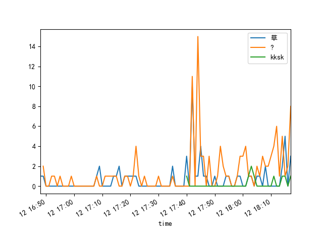

<h1 align="center">
  
</h1>

# 暴言统计器
----

抓取某个b站直播间内的所有发言，并对奇怪的地方进行统计（目前只有主播送给观众的问号风暴、草风暴和kksk风暴）

监听弹幕部分使用 https://github.com/yjqiang/bili2.0 的代码

## 使用方法
----
1. 安装[Python3](https://python.org/)
2. 执行`pip install -r requirements.txt` 安装所需依赖
3. 执行`python3 main.py 房间号`采集当前直播间弹幕，将会按照开播/下播自动分段文件
4. 执行`python3 praser.py 文件名`分析所在位置，将输出图表形式方便剪辑man进行处理

